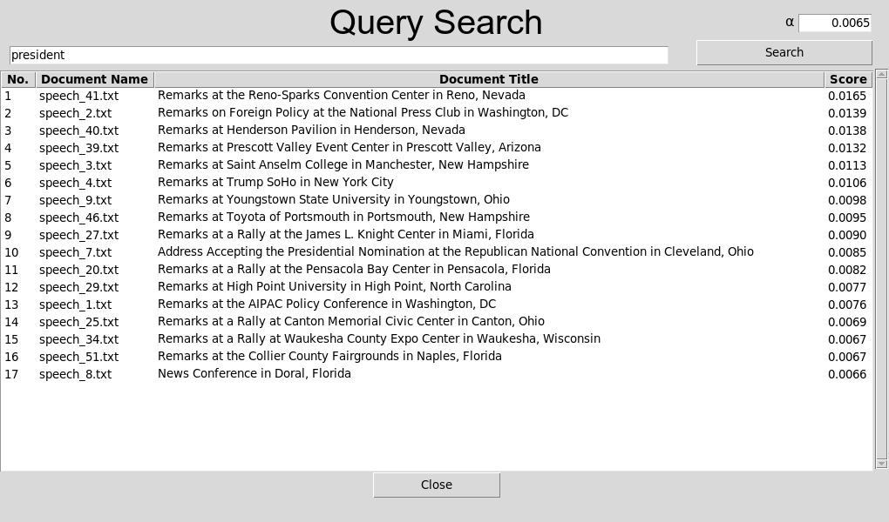

<!-- TODO: REPLACE ALL `document-relevance-score-calculator`, `Vector Space Model`, `Document's relevancy using tf-idf and cosine similarity on Vector Space Model`. FILL "about the project" and uncomment hidden sections if needed -->
<a name="readme-top"></a>

<!-- [![Contributors][contributors-shield]][contributors-url] -->
[![Stargazers][stars-shield]][stars-url]
[![Forks][forks-shield]][forks-url]
[![Issues][issues-shield]][issues-url]
[![MIT License][license-shield]][license-url]
[![LinkedIn][linkedin-shield]][linkedin-url]


<!-- PROJECT LOGO -->
<br />
<div align="center">
  <!-- <a href="https://github.com/InfiniteLoopify/document-relevance-score-calculator">
    
  </a> -->
<h3 align="center">Vector Space Model</h3>

  <p align="center">
    Document's relevancy using tf-idf and cosine similarity on Vector Space Model
    <br />
    <a href="https://github.com/InfiniteLoopify/document-relevance-score-calculator"><strong>Explore the docs »</strong></a>
    <br />
    <br />
    <!-- <a href="https://github.com/InfiniteLoopify/document-relevance-score-calculator">View Demo</a>
    · -->
    <a href="https://github.com/InfiniteLoopify/document-relevance-score-calculator/issues/new?labels=bug&template=bug-report---.md">Report Bug</a>
    ·
    <a href="https://github.com/InfiniteLoopify/document-relevance-score-calculator/issues/new?labels=enhancement&template=feature-request---.md">Request Feature</a>
  </p>
</div>


<!-- TABLE OF CONTENTS -->
<details open>
  <summary>Table of Contents</summary>
  <ol>
    <li>
      <a href="#about-the-project">About The Project</a>
      <ul>
        <li><a href="#built-with">Built With</a></li>
      </ul>
    </li>
    <li>
      <a href="#getting-started">Getting Started</a>
      <ul>
        <li><a href="#prerequisites">Prerequisites</a></li>
        <li><a href="#installation">Installation</a></li>
      </ul>
    </li>
    <li><a href="#usage">Usage</a></li>
    <!-- <li><a href="#roadmap">Roadmap</a></li> -->
    <!-- <li><a href="#contributing">Contributing</a></li> -->
    <!-- <li><a href="#support">Support</a></li> -->
    <li><a href="#license">License</a></li>
    <li><a href="#contact">Contact</a></li>
    <!-- <li><a href="#acknowledgments">Acknowledgments</a></li> -->
  </ol>
</details>


<!-- ABOUT THE PROJECT -->
## About The Project

Calculate Document's relevancy and ranking using tf-idf and cosine similarity on Vector Space Model for more than 50 political speeches in the United States.


*document relevency of the word 'president', sorted by cosine similarity score (α)*

<p align="right">(<a href="#readme-top">back to top</a>)</p>


### Built With


* [![Python][Python-shield]][Python-url]
* [![Tkinter][Tkinter-shield]][Tkinter-url]
* [![Numpy][Numpy-shield]][Numpy-url]
* [![Nltk][Nltk-shield]][Nltk-url]


<p align="right">(<a href="#readme-top">back to top</a>)</p>


<!-- GETTING STARTED -->
## Getting Started

### Prerequisites
Before you begin, ensure you have met the following requirements:

* **Python** 
Make sure you have Python installed on your system. You can download and install Python from the official [Python Website](https://www.python.org/downloads/).

### Installation
To install and run the program, follow these steps:
Windows

1. Open Command Prompt.
2. Clone the repository:
    ```bash
    git clone https://github.com/InfiniteLoopify/document-relevance-score-calculator.git
    ```
3. Navigate to the project directory:
    ```bash
    cd document-relevance-score-calculator
    ```
4. Create a virtual environment and activate it:
    <details open>
    <summary>For Windows</summary>
    
    ```bash
    python -m venv venv    # create virtual environment
    venv\Scripts\activate  # activate virtual environment
    ```
    </details>
    <details open>
    <summary>For Linux/MacOS</summary>
    
    ```bash
    python3 -m venv venv      # create virtual environment
    source venv/bin/activate  # activate virtual environment
    ```
    </details>
5. Install dependencies:

    ```bash
    pip install -r requirements.txt
    ```

<p align="right">(<a href="#readme-top">back to top</a>)</p>

<!-- USAGE EXAMPLES -->
## Usage

To use the program, follow these steps:
1. Make sure you have activated the virtual environment.
2. Run the program:
    ```bash
    python main.py
    ```

<p align="right">(<a href="#readme-top">back to top</a>)</p>


<!-- ROADMAP -->
<!-- 
## Roadmap

- [ ] Feature 1
- [ ] Feature 2
- [ ] Feature 3
    - [ ] Nested Feature

See the [open issues](https://github.com/InfiniteLoopify/document-relevance-score-calculator/issues) for a full list of proposed features (and known issues).

<p align="right">(<a href="#readme-top">back to top</a>)</p> 
-->


<!-- CONTRIBUTING -->
<!-- 
## Contributing

Contributions are what make the open source community such an amazing place to learn, inspire, and create. Any contributions you make are **greatly appreciated**.

If you have a suggestion that would make this better, please fork the repo and create a pull request. You can also simply open an issue with the tag "enhancement".
Don't forget to give the project a star! Thanks again!

1. Fork the Project
2. Create your Feature Branch (`git checkout -b feature/AmazingFeature`)
3. Commit your Changes (`git commit -m 'Add some AmazingFeature'`)
4. Push to the Branch (`git push origin feature/AmazingFeature`)
5. Open a Pull Request

<p align="right">(<a href="#readme-top">back to top</a>)</p> 
-->


<!-- SUPPORT -->
<!-- 
## Support
Whether you use this project, have learned something from it, or just like it, please consider supporting it by buying me a coffee, so I can dedicate more time on open-source projects like this :)

<a href="https://www.buymeacoffee.com/igorantun" target="_blank"></a>

<p align="right">(<a href="#readme-top">back to top</a>)</p> 
-->


<!-- LICENSE -->
## License

Distributed under the MIT License. See `LICENSE` for more information.

<p align="right">(<a href="#readme-top">back to top</a>)</p>


<!-- CONTACT -->
## Contact

Umair Shahab - [LinkedIn][linkedin-url] - umair.shahab.ahmed@gmail.com

Project Link: [https://github.com/InfiniteLoopify/document-relevance-score-calculator](https://github.com/InfiniteLoopify/document-relevance-score-calculator)

<p align="right">(<a href="#readme-top">back to top</a>)</p>


<!-- ACKNOWLEDGMENTS -->
<!-- 
## Acknowledgments
* []()
* []()
* []() 
<p align="right">(<a href="#readme-top">back to top</a>)</p>
-->


<!-- MARKDOWN LINKS & IMAGES -->

[contributors-shield]: https://img.shields.io/github/contributors/InfiniteLoopify/document-relevance-score-calculator.svg?style=for-the-badge
[contributors-url]: https://github.com/InfiniteLoopify/document-relevance-score-calculator/graphs/contributors
[forks-shield]: https://img.shields.io/github/forks/InfiniteLoopify/document-relevance-score-calculator.svg?style=for-the-badge
[forks-url]: https://github.com/InfiniteLoopify/document-relevance-score-calculator/network/members
[stars-shield]: https://img.shields.io/github/stars/InfiniteLoopify/document-relevance-score-calculator.svg?style=for-the-badge
[stars-url]: https://github.com/InfiniteLoopify/document-relevance-score-calculator/stargazers
[issues-shield]: https://img.shields.io/github/issues/InfiniteLoopify/document-relevance-score-calculator.svg?style=for-the-badge
[issues-url]: https://github.com/InfiniteLoopify/document-relevance-score-calculator/issues
[license-shield]: https://img.shields.io/github/license/InfiniteLoopify/document-relevance-score-calculator.svg?style=for-the-badge
[license-url]: https://github.com/InfiniteLoopify/document-relevance-score-calculator/blob/master/LICENSE
[linkedin-shield]: https://img.shields.io/badge/LinkedIn-%230a66c2.svg?style=for-the-badge&logo=linkedin
[linkedin-url]: https://linkedin.com/in/UmairShahab

[Next-shield]: https://img.shields.io/badge/next.js-000000?style=for-the-badge&logo=nextdotjs&logoColor=white
[Next-url]: https://nextjs.org/
[Nuxt-shield]: https://img.shields.io/badge/Nuxt.js-002E3B?style=for-the-badge&logo=nuxtdotjs&logoColor=#00DC82
[Nuxt-url]: https://nuxt.com/
[Tailwind-shield]: https://img.shields.io/badge/tailwind_css-%2338B2AC.svg?style=for-the-badge&logo=tailwind-css&logoColor=white
[Tailwind-url]: https://nuxt.com/
[React-shield]: https://img.shields.io/badge/React-20232A?style=for-the-badge&logo=react&logoColor=61DAFB
[React-url]: https://reactjs.org/
[Vue-shield]: https://img.shields.io/badge/Vue.js-35495E?style=for-the-badge&logo=vuedotjs&logoColor=4FC08D
[Vue-url]: https://vuejs.org/
[Angular-shield]: https://img.shields.io/badge/Angular-DD0031?style=for-the-badge&logo=angular&logoColor=white
[Angular-url]: https://angular.io/
[Svelte-shield]: https://img.shields.io/badge/Svelte-4A4A55?style=for-the-badge&logo=svelte&logoColor=FF3E00
[Svelte-url]: https://svelte.dev/
[Laravel-shield]: https://img.shields.io/badge/Laravel-FF2D20?style=for-the-badge&logo=laravel&logoColor=white
[Laravel-url]: https://laravel.com
[Bootstrap-shield]: https://img.shields.io/badge/Bootstrap-563D7C?style=for-the-badge&logo=bootstrap&logoColor=white
[Bootstrap-url]: https://getbootstrap.com
[JQuery-shield]: https://img.shields.io/badge/jQuery-0769AD?style=for-the-badge&logo=jquery&logoColor=white
[JQuery-url]: https://jquery.com 

[Python-shield]: https://img.shields.io/badge/Python-ffd54f?style=for-the-badge&logo=python&logoColor=428ac3
[Python-url]: https://python.org
[Python_alt-shield]: https://img.shields.io/badge/Python-14354C?style=for-the-badge&logo=python&logoColor=white

[Nltk-shield]: https://img.shields.io/badge/Nltk-000000?style=for-the-badge&logo=python&logoColor=white
[Nltk-url]: https://www.nltk.org/

[Javascript-shield]: https://img.shields.io/badge/JavaScript-323330?style=for-the-badge&logo=javascript&logoColor=F7DF1E
[Javascript-url]: https://javascript.com
[Django-shield]: https://img.shields.io/badge/Django-092E20?style=for-the-badge&logo=django&logoColor=white
[Django-url]: https://www.djangoproject.com/
[Flask-shield]: https://img.shields.io/badge/Flask-000000?style=for-the-badge&logo=flask&logoColor=white
[Flask-url]: https://flask.palletsprojects.com/
[Fastapi-shield]: https://img.shields.io/badge/Fastapi-222222?style=for-the-badge&logo=fastapi
[Fastapi-url]: https://fastapi.tiangolo.com/
[Pyqt-shield]: https://img.shields.io/badge/PyQt-217346?style=for-the-badge&logo=qt&logoColor=white
[Pyqt-url]: https://www.riverbankcomputing.com/software/pyqt/
[Tkinter-shield]: https://img.shields.io/badge/tkinter-000088?style=for-the-badge&logo=robinhood&logoColor=cccccc
[Tkinter-url]: https://docs.python.org/3/library/tkinter.html
[Alpine.js-shield]: https://img.shields.io/badge/alpine.js-2d3441?style=for-the-badge&logo=alpinedotjs&logoColor=%2377c1d2
[Alpine.js-url]: https://alpinejs.dev/
[Htmx-shield]: https://img.shields.io/badge/htmx-3d72d7?style=for-the-badge&logo=htmx&logoColor=%23abc9ff
[Htmx-url]: https://htmx.org/
[Selenium-shield]: https://img.shields.io/badge/-selenium-43B02A?style=for-the-badge&logo=selenium&logoColor=white
[Selenium-url]: https://www.selenium.dev/
[Playwright-shield]: https://img.shields.io/badge/Playwright-1d8d22?style=for-the-badge&logo=Playwright&logoColor=white
[Playwright-url]: https://playwright.dev/python/
[Pandas-shield]: https://img.shields.io/badge/pandas-%23150458.svg?style=for-the-badge&logo=pandas&logoColor=white
[Pandas-url]: https://pandas.pydata.org/
[Docker-shield]: https://img.shields.io/badge/docker-%230db7ed.svg?style=for-the-badge&logo=docker&logoColor=white
[Docker-url]: https://www.docker.com/
[Aws-shield]: https://img.shields.io/badge/AWS-%23FF9900.svg?style=for-the-badge&logo=amazon-aws&logoColor=white
[Aws-url]: https://aws.amazon.com/
[Retool-shield]: https://img.shields.io/badge/Retool-%23000000.svg?style=for-the-badge&logo=Retool
[Retool-url]: https://retool.com/
[Nginx-shield]: https://img.shields.io/badge/nginx-%23009639.svg?style=for-the-badge&logo=nginx&logoColor=white
[Nginx-url]: https://www.nginx.com/
[Bash-shield]: https://img.shields.io/badge/Bash_script-%23121011.svg?style=for-the-badge&logo=gnu-bash&logoColor=white
[Bash-url]: https://www.gnu.org/software/bash/
[Mysql-shield]: https://img.shields.io/badge/mysql-4479A1.svg?style=for-the-badge&logo=mysql&logoColor=white
[Mysql-url]: https://www.mysql.com/
[Postgres-shield]: https://img.shields.io/badge/postgres-%23316192.svg?style=for-the-badge&logo=postgresql&logoColor=white
[Postgres-url]: https://www.postgresql.org/
[Sqlite-shield]: https://img.shields.io/badge/sqlite-%2307405e.svg?style=for-the-badge&logo=sqlite&logoColor=white
[Sqlite-url]: https://www.sqlite.org/
[Redis-shield]: https://img.shields.io/badge/redis-%23DD0031.svg?style=for-the-badge&logo=redis&logoColor=white
[Redis-url]: https://redis.io/
[Firebase-shield]: https://img.shields.io/badge/firebase-a08021?style=for-the-badge&logo=firebase&logoColor=ffcd34
[Firebase-url]: https://firebase.google.com/
[Github_actions-shield]: https://img.shields.io/badge/github%20actions-%232671E5.svg?style=for-the-badge&logo=githubactions&logoColor=white
[Github_actions-url]: https://github.com/features/actions
[Pytest-shield]: https://img.shields.io/badge/pytest-%23414141.svg?style=for-the-badge&logo=pytest
[Pytest-url]: https://pytest.org/
[Jupyter-shield]: https://img.shields.io/badge/jupyter-%23FA0F00.svg?style=for-the-badge&logo=jupyter&logoColor=white
[Jupyter-url]: https://jupyter.org/
[Keras-shield]: https://img.shields.io/badge/Keras-%23D00000.svg?style=for-the-badge&logo=Keras&logoColor=white
[Keras-url]: https://keras.io/
[Matplotlib-shield]: https://img.shields.io/badge/Matplotlib-%23cccccc.svg?style=for-the-badge&logoColor=black&logo=coronaengine
[Matplotlib-url]: https://matplotlib.org/
[Numpy-shield]: https://img.shields.io/badge/numpy-%23013243.svg?style=for-the-badge&logo=numpy&logoColor=white
[Numpy-url]: https://numpy.org/
[Scikitlearn-shield]: https://img.shields.io/badge/scikit--learn-%23F7931E.svg?style=for-the-badge&logo=scikit-learn&logoColor=white
[Scikitlearn-url]: https://scikit-learn.org/

